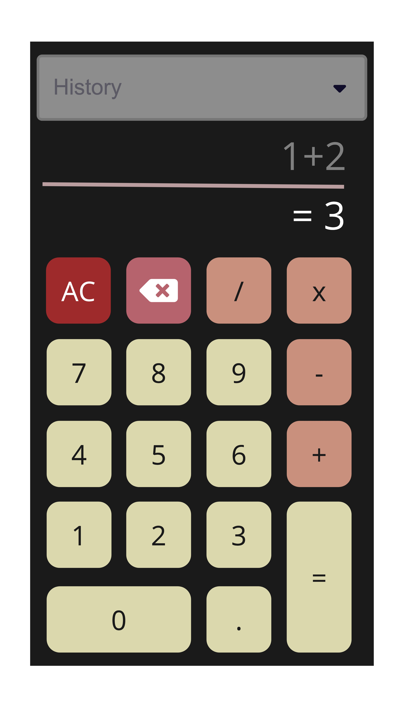
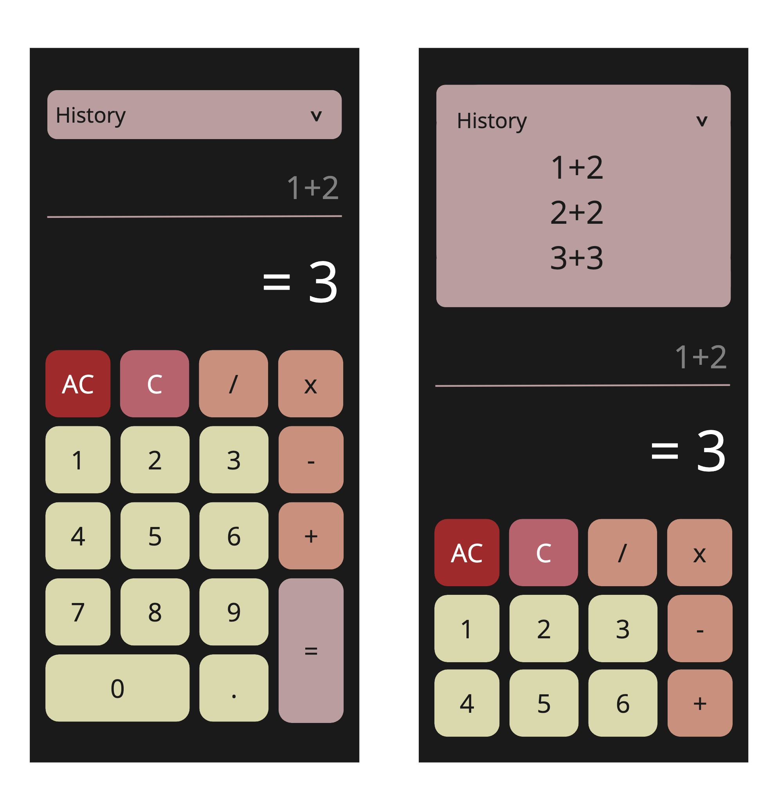

# Artifacts

## Meeting recording link(s)

Short summary of the meeting:

- This video shows the group's design process, which leads to our final design. Before the meeting, we individually developed our interpretations of the brief and added them to the miro.
- The meeting began with the team evaluating each design by adding sticky notes on the board showing what others thought were strengths and weaknesses.
- for the final design. As a group, We chose a favorite design and adapted elements from other strengths to improve it.

Timestamps:

- 4-9 mins adding sticky notes to each others designs strengths and weaknesses.
- 9-10 mins deciding favorite design
- 10-11 mins moving design to bigger view.
- 11-29 mins adapting elements from other strengths to improve it.
- 33 backspace button and all clear meanings
- 40 font sizing ratio, possible error message
- 51 accordion view

https://drive.google.com/file/d/16YmQ--P92b1lMBmqJKm0g3Mi4ZmacGox/view?usp=sharing

# First draft wireframe

### Strengths

From Harley:

- Rounded buttons look good
- color theme is matched
- input and output fields are in thumb 'dead' zone
- big '=' button

From Angelo:

- Like the history at the top
- Buttons are nicely segregated.

### Weaknesses

From Harley:

- Change color of history drop down?

# Teams final wireframe

## Justifications

### No ambiguous icons

- AC - clears all history C - clears recent input and calculation

- We added AC and C buttons to avoid confusion with the backspace icon.

### Don't clutter the screen, Minimize user input

- We have added the history accordion to the top of the screen. so the user does not have to scroll the page to see their pervious calculations.
- Made the 0 and = buttons larger to avoid unnecessary buttons.

### Easy to read via font and color contrast

- the color scheme we stuck to the colors provided for the company.
- Size between equation and result is a ration of 1/1.5 to make the result stand out.
- All buttons will have the same sized font for readability.

Colors:

- The main use of the calculator is the ability to input numbers therefore we chose this as the main color.
- The secondary use is to input the operand so that became our secondary color
- the equals button is the result which shows the information so we chose the info color.
- C clears recent input and calculation so we chose the warning color
- AC button clears all history so we chose the error color

### "Thumb zone" is taken into consideration

Buttons are in thumb zone, output is out of thumb zone you only want to view the calculation. the 0 and equals button is enlarged to accommodate the thumb zone when using either hand.

The main use of the calculator is to do an equation there for everything we need to do that as easily accessible.

The secondary use is to view the history of a past calculation so we have added this up the top of the screen in the hard/stretching area of the screen.
